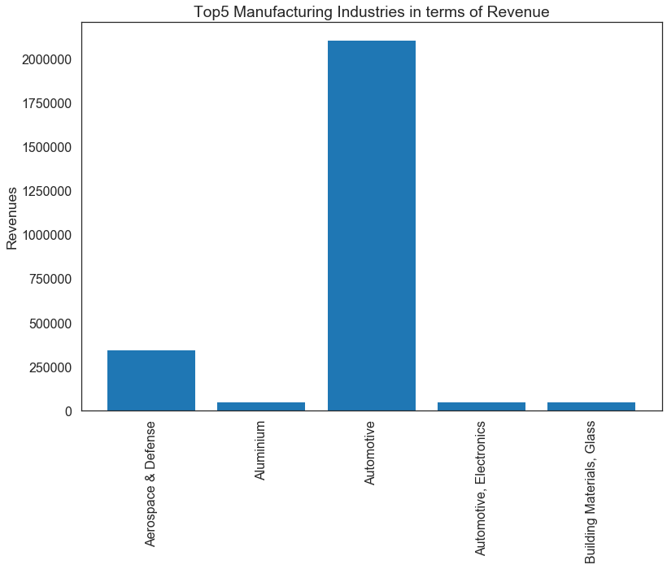

# wm-final-project-KaranamVijayKumar

# Top 5 Manufacturing Industries in terms of Revenue
## Introduction
The purpose of the project is to find out, of all the manufacturing industries which industry generates maximum amount of revenue and plot the top five revenue generators in the bar graph.
## Materials/Methods
The python library BeautifulSoup was used to scrape the Wikipedia data from the web and matplotlib was used to plot the bar graph.
## Resources Used
* Wikipedia for data source.
* Beautiful Soup and Matplotlib for generating results.
## Results

## Conclusion
If we observe our bar chart Automotive Industry is the clear winner that generates maximum amount of revenue out of all industries, then comes the Aerospace & Defense Industry. There isn’t much difference among the rest of three  industries in terms of revenue generation. From the results it is obvious that Automotive Industry involves a lot of money around it. 
## GitHub Repo Link
https://github.com/44520-s19/wm-final-project-KaranamVijayKumar
